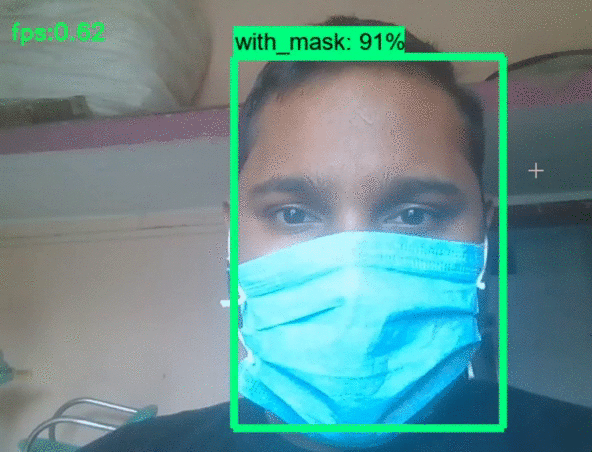

# Welcome to Face Mask Detection 👋
### 🏠 [Homepage](https://github.com/devil-cyber/Mask-Detection)

[](https://devil-cyber.github.io/CodingSpace/mask-detection/)
[](#)
[](https://twitter.com/Manikan09676833)
[](https://share.streamlit.io/devil-cyber/mask-detection/app.py)

> This is a MobileNetV2 based object detection model that detects the person face mask.It can clearly detect face mask in group of people with a great ease.



> Get the Live demo at [Click](https://share.streamlit.io/devil-cyber/mask-detection/app.py). Try to upload image <= 1 MB of size.


## Install

```python

# To get started with this project first create env. if you have Anaconda then create env using below command:
conda create -n [env name] python=3.6
# If you does not have Anaconda the create env using virtualenv follow below command:
pip install virtualenv
python -m [env name] env
# After creating enivornment now install all requirements
pip install -r requirements.txt

```


## Run App

```sh
python mask_detection.py
```
## Dataset
- `You can get dataset from kaggle` [Face Mask Data](https://www.kaggle.com/andrewmvd/face-mask-detection)
- `You can also create own dataset by clicking own pic with Mask and Without Mask using`  create_dataset.py file


## Author

👤 **Manikant Kumar**

* Website: https://devil-cyber.github.io/CodingSpace/
* Twitter: [@Manikan31004419](https://twitter.com/Manikan09676833)
* Github: [@devil-cyber](https://github.com/devil-cyber)
* LinkedIn: [@manikant-kumar-550998192](https://linkedin.com/in/manikant-kumar-550998192)

## Show your support

Give a ⭐️ if this project helped you!


***
 
